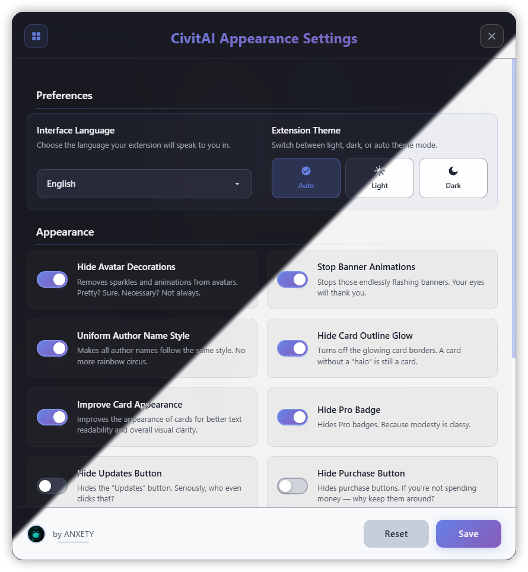

# 🎨 CivitAI Shit (Design) Controller | WIP

> [!Tip]
> A Chrome browser extension that removes annoying decorations on CivitAI</br>
> This is my first extension and my first major project with JS, so the implementation is pretty terrible :3

> [!Warning]
> This extension is a joke and was made as a fun experiment, not professionally. The code is terrible, the implementation is a mess, and honestly—CivitAI itself is kind of bullshit :33

[](https://github.com/anxety-solo/civitai-design-controller)

<div align="center">
  
</div>

</br>

<details>
  <summary><strong>🖼️ Card Preview Example (click to expand/collapse)</strong></summary>

  <div align="center">
    
  </div>
  <p align="center">
    <em>This is how cards look with the visual enhancement feature enabled.<br>
    (Can you even tell the difference?! I think it's awesome! :33)</em>
  </p>

</details>

<h1></h1>

### ✨ Features

#### **Visual Customization**

-   [x] **🎭 Avatar Animations Control** - Hides decorative user avatar overlays and sparkles from profile pictures
-   [x] **🏅 Profile Badges** - Hides decorative badges and achievement indicators from user profiles
-   [x] **🎪 Profile Banner Management** - Removes flashing video animations from profile banner cards
-   [x] **👤 Author Name Normalization** - Applies uniform white text styling to author usernames on model cards
-   [x] **✨ Card Glow Effects** - Removes glowing borders, cosmetic frames, and decorative pseudo-elements from model cards
-   [x] **🖼️ Card Visual Enhancement** - Improves card readability with backdrop blur effects on info chips, better text sizing, and gradient shadows for footer text
-   [x] **🏆 Pro Badge Visibility** - Hides Pro subscription buttons
-   [x] **🔄 Updates Button Control** - Removes the "Updates" navigation link from the site header
-   [x] **💰 Purchase Button Management** - Hides the "Shop" navigation link from the site header

### 🚧 **In Development / Planned**

-   [x] **Complete Light Theme Implementation** - Full light theme support
-   [x] **Automatic Website Theme Detection** - Sync with CivitAI's theme
-   [ ] **Switch to JavaScript-Based Element Manipulation** - Use JavaScript to hide or modify elements for more reliable and granular settings (video elements are a priority :<)
-   [ ] **Additional Visual Filters** - More customization options
-   [ ] **Performance Optimizations** - Reduce memory usage and improve speed

## 📦 Installation

1. Clone this repository:
    ```bash
    git clone https://github.com/anxety-solo/civitai-design-controller
    ```
2. Open Chrome and navigate to `chrome://extensions/`
3. Enable "Developer mode" in the top right
4. Click "Load unpacked" and select the project folder
5. The extension will now be available on CivitAI.com

## 🎮 Usage

1. Navigate to [CivitAI.com](https://civitai.com)
2. Look for the floating control button (🎨) in the top navigation
3. Click to open the settings panel
4. Toggle features on/off as needed
5. Save Settings :3

<h1></h1>

> [!Note]
> **This extension uses CSS to hide elements and change the appearance of the page**.</br>
> As a result, it may not remove all decorations elements 100% in every case.</br>
> _It may also cause false hiding..._
