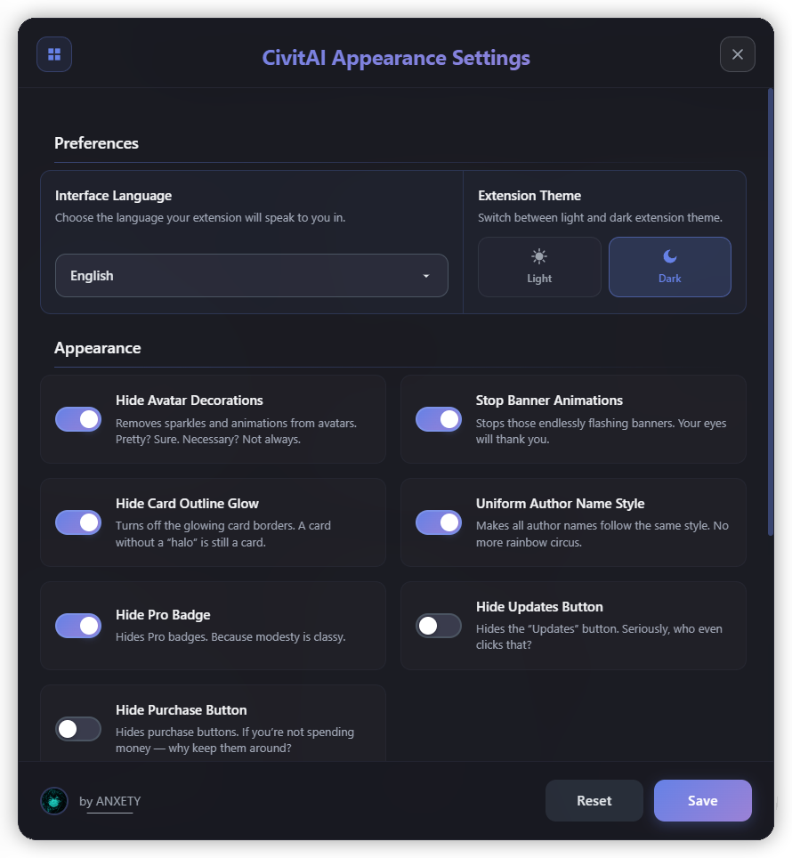
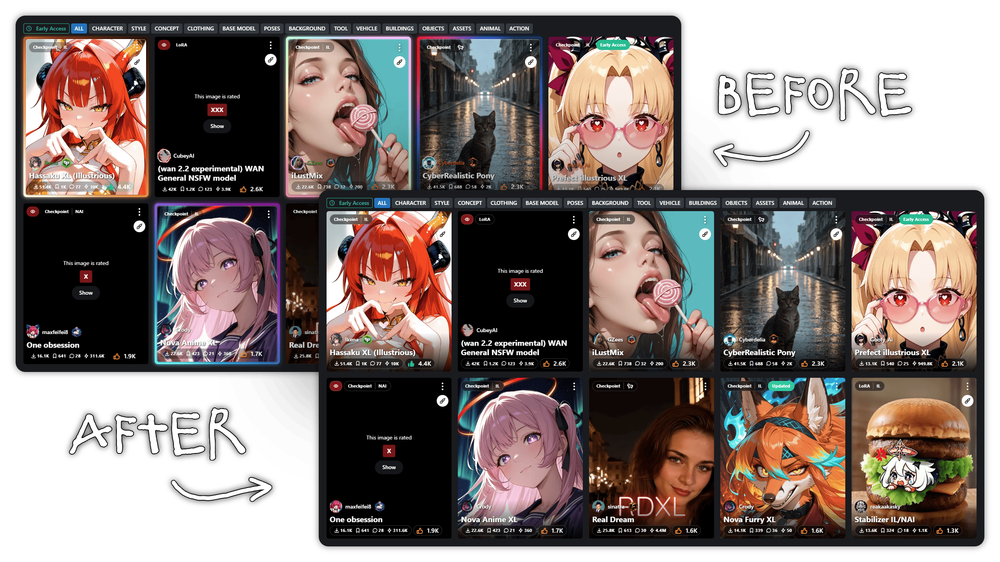

# 🎨 CivitAI Shit (Design) Controller | WIP

> [!Tip]
> A Chrome browser extension that removes annoying decorations on CivitAI</br>
> This is my first extension and my first major project with JS, so the implementation is pretty terrible :3

[](https://github.com/anxety-solo/civitai-design-controller)

<div align="center">
  
</div>

</br>

<details>
  <summary><strong>🖼️ Card Preview Example (click to expand/collapse)</strong></summary>

  <div align="center">
    
  </div>
  <p align="center">
    <em>This is how cards look with the visual enhancement feature enabled.<br>
    (Can you even tell the difference?! I think it's awesome! :33)</em>
  </p>

</details>

<h1></h1>

### ✨ Features

#### **Visual Customization**

- [x] **🎭 Avatar Animations Control** - Hide sparkles and animations from user avatars
- [ ] **🎪 Profile Banner Management** - Stop endlessly flashing profile banners
- [x] **👤 Author Name Normalization** - Uniform styling for author names across the platform
- [x] **✨ Card Glow Effects** - Toggle glowing card borders and outlines
- [x] **🖼️ Card Visual Enhancement** - Improve card details for better text readability and overall visual clarity
- [x] **🏆 Pro Badge Visibility** - Hide Pro badges for a cleaner interface
- [x] **🔄 Updates Button Control** - Hide the "Updates" button if not needed
- [x] **💰 Purchase Button Management** - Hide purchase buttons for non-spending users

### 🚧 **In Development / Planned**

- [x] **Complete Light Theme Implementation** - Full light theme support
- [x] **Automatic Website Theme Detection** - Sync with CivitAI's theme
- [ ] **Additional Visual Filters** - More customization options
- [ ] **Performance Optimizations** - Reduce memory usage and improve speed

## 📦 Installation

1. Clone this repository:
   ```bash
   git clone https://github.com/anxety-solo/civitai-design-controller
   ```
2. Open Chrome and navigate to `chrome://extensions/`
3. Enable "Developer mode" in the top right
4. Click "Load unpacked" and select the project folder
5. The extension will now be available on CivitAI.com

## 🎮 Usage

1. Navigate to [CivitAI.com](https://civitai.com)
2. Look for the floating control button (🎨) in the top navigation
3. Click to open the settings panel
4. Toggle features on/off as needed
5. Save Settings :3

<h1></h1>

> [!Note]
> **This extension uses CSS to hide elements and change the appearance of the page**.</br>
> As a result, it may not remove all decorations elements 100% in every case.</br>
> _It may also cause false hiding..._